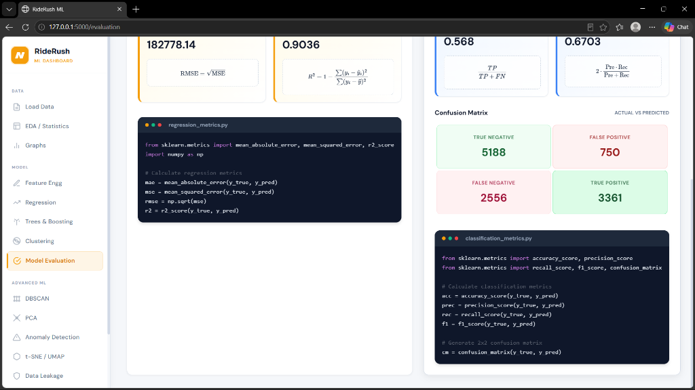
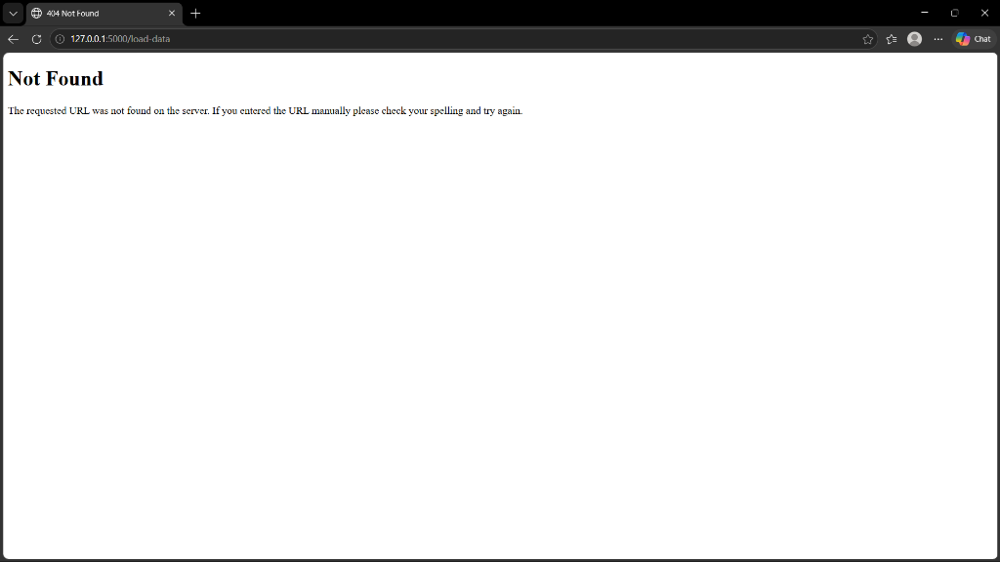

# RideRush — NYC FHV Intelligence Platform 🚕


RideRush is a comprehensive, production-ready Machine Learning Dashboard and Analytics Platform built for analyzing New York City's For-Hire Vehicle (FHV) dispatch data. 

Transitioning from a static frontend to a highly modular **Flask** backend, this application applies various statistical and machine learning techniques to real-world TLC datasets, predicting trip volumes, finding anomalies, and identifying fleet clusters.

---


## 📸 Screenshots

### Model Evaluation Dashboard
*(Featuring Color-coded metrics, Jump-links, MathJax formulas, and Heatmap Confusion Matrices)*


### Authentication & Login Portal
*(Featuring Full-screen split layout and AI-generated NYC data illustrations)*


---

## 🚀 Key Features

### 1. Landing & Authentication
* **Premium UI**: Dark-navy themes, GSAP scroll animations, and interactive hero sections.
* **Login Portal**: Full-screen split layout featuring an AI-generated New York City data illustration.

### 2. Data Exploration (EDA) & Visualization
* **Dataset Loader**: Live preview of the FHV dataset (dtypes, missing values, rows/columns).
* **EDA / Statistics**: Distribution charts, categorical counts, and statistical summaries.
* **Graphs**: Correlation matrices, scatter plots, and time-series trend lines using Matplotlib (Base64 rendered).

### 3. Machine Learning Models
* **Feature Engineering**: Correlation mapping and automated feature scaling (StandardScaler/MinMaxScaler).
* **Regression**: Simple Linear, Multiple Linear, Ridge (L2), and Logistic Regression with interactive jump links.
* **Trees & Boosting**: Decision Trees, Random Forests, Gradient Boosting (GBM), and AdaBoost.
* **Clustering**: K-Means (with Elbow Method) and Agglomerative Hierarchical Clustering.

### 4. Advanced ML Algorithms
* **DBSCAN**: Density-based spatial clustering for noise identification.
* **PCA**: Principal Component Analysis for dimensionality reduction (2D/3D visualizations).
* **Anomaly Detection**: Isolation Forest and Local Outlier Factor for spotting irregular fleet behaviors.
* **t-SNE / UMAP**: Manifold learning for high-dimensional data visualization.
* **Data Leakage Mitigation**: Demonstrations of target leakage and how to properly split/scale data to prevent it.

### 5. Comprehensive Model Evaluation
* **Regression Metrics**: MAE, MSE, RMSE, and R² Score.
* **Classification Metrics**: Accuracy, Precision, Recall, and F1 Score.
* **Visuals & Math**: Heatmap-styled Confusion Matrices and elegantly rendered **MathJax** mathematical formulas.

---

## 📦 Tech Stack

* **Backend**: Python 3, Flask, Werkzeug
* **Machine Learning**: Scikit-Learn, Pandas, NumPy, SciPy
* **Data Visualization**: Matplotlib, Seaborn
* **Frontend**: HTML5, Custom CSS, GSAP, MathJax (for LaTeX rendering)

---

## 📁 Architecture & Structure

The codebase is highly modularized utilizing Flask Blueprints, ensuring a strict 1:1 mapping between backend routes and frontend templates.

```text
RideRush/
├── app.py                  # App entry point & blueprint registration
├── utils.py                # Shared dataset loading and visualization utilities
├── routes/                 # Blueprint controllers
│   ├── load_data.py
│   ├── eda.py
│   ├── graphs.py
│   ├── feature_engg.py
│   ├── regression.py
│   ├── trees.py
│   ├── clustering.py
│   ├── dbscan.py
│   ├── pca.py
│   ├── anomaly.py
│   ├── tsne_umap.py
│   ├── data_leakage.py
│   └── evaluation.py       # Math formulas, confusion matrix & metrics
├── templates/              # Jinja2 HTML templates
│   ├── base.html           # Master layout and sidebar navigation
│   ├── index.html          # Landing page
│   ├── login.html          # Authentication page
│   └── ...                 # Dashboard view templates
├── static/                 # Static assets
│   ├── dashboard.css
│   ├── style.css
│   └── login_illustration.jpg
└── dataset/
    └── fhv_bases.csv       # NYC TLC FHV dataset
```

---

## 🏃 Run Locally

1. **Clone the repository:**
   ```bash
   git clone https://github.com/shambhavi-mahi/RideRush.git
   cd RideRush
   ```

2. **Install dependencies:**
   *(Ensure you have Python 3 installed. Using a virtual environment is recommended).*
   ```bash
   pip install flask pandas numpy scikit-learn matplotlib seaborn
   ```

3. **Start the Flask Server:**
   ```bash
   python app.py
   ```

4. **Access the Dashboard:**
   * Landing Page: `http://127.0.0.1:5000/`
   * Dashboard: `http://127.0.0.1:5000/load-data`

---

## 📊 About the Dataset
Powered by the [NYC TLC FHV Base Aggregate Report](https://data.cityofnewyork.us/) — containing 59,000+ monthly records spanning from 2015 to 2026, encompassing active vehicles, dispatched trips, and shared ride data across all five boroughs.